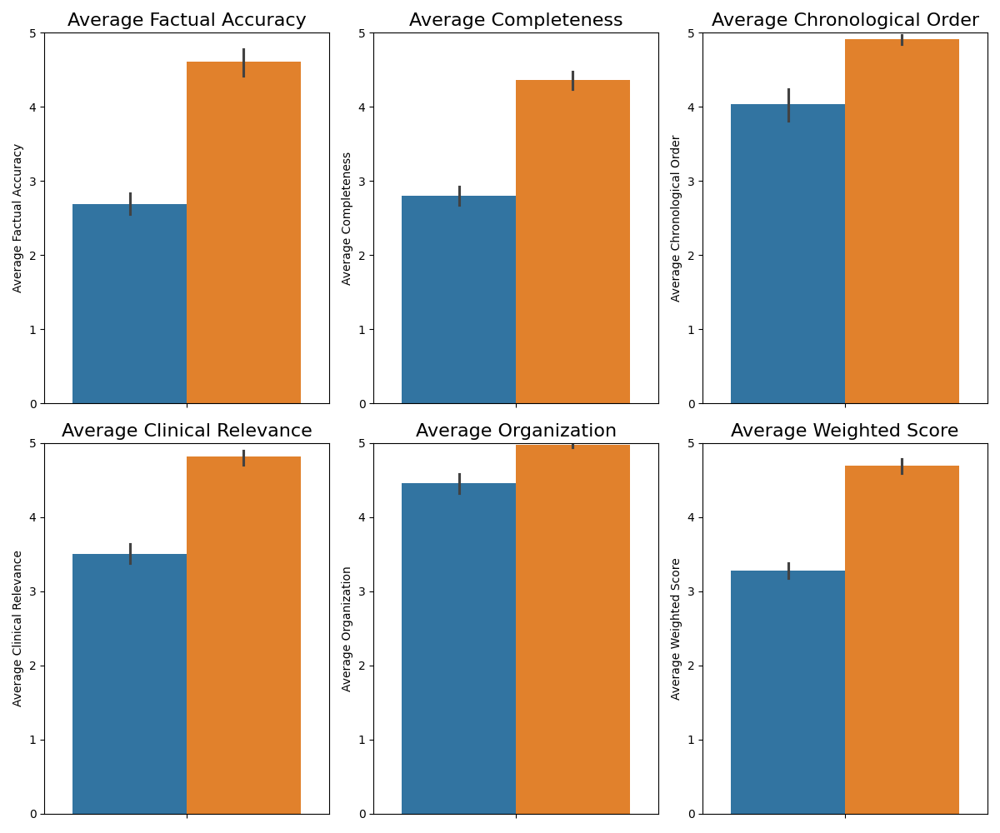
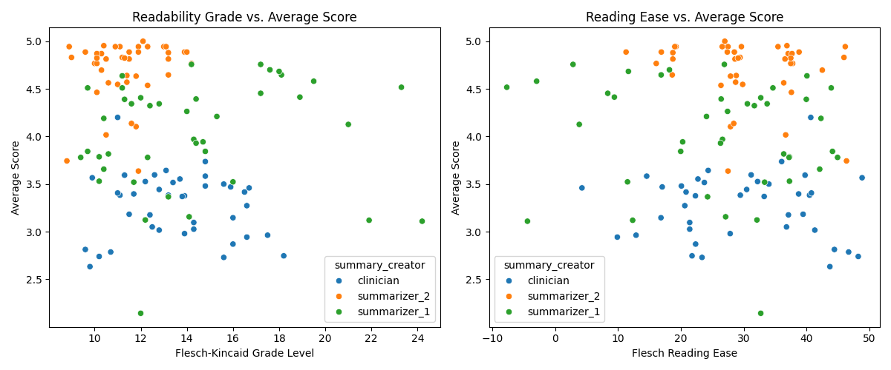

# Evaluation Frameworks for AI-Generated Veterinary Medical Record Summaries

**Tyler Poore1, Aleena Shabbir1, Christopher J Pinard1,2,3,4, Andrew Lagree1, Kuan-Chuen Wu1**

1 ANI.ML Research, ANI.ML Health Inc., Toronto ON Canada
2 Department of Clinical Studies, University of Guelph, Guelph ON Canada
3 Toronto Animal Cancer Centre, Toronto, ON Canada
4 Centre for Responsible & Ethical Artificial Intelligence (CARE-AI), University of Guelph, Guelph ON Canada

**GitHub Repository:** [github.com/pooret-animl/vet-summary-eval-framework](https://github.com/pooret-animl/vet-summary-eval-framework)

*This work forms the basis of a presentation at the SAVY Conference (May 2025).*

## Abstract

**Background:** Medical record summarization is a critical yet time-consuming task in veterinary practice. Artificial intelligence (AI) language models show promise in this area, but their performance compared to veterinary professionals in summarizing clinical records, and standardized evaluation frameworks for such comparisons, have been largely unexplored. This project addresses this gap by developing and validating a structured framework to evaluate AI-generated veterinary medical record summaries against those created by clinicians.

**Objective:** To develop and validate a structured evaluation framework for assessing veterinary medical record summarizations, and to apply this framework in comparing the performance of various AI language models, our "Hachiko v1.4" custom framework, and our advanced "Hachiko 2.0" system against practicing veterinarians. Key findings indicate that advanced AI systems like "Hachiko 2.0" can produce high-quality summaries, often outperforming human-written ones, particularly in factual accuracy and completeness, and that such AI-powered tools can be valuable in enhancing the creation and assessment of veterinary medical summaries, potentially alleviating veterinarian workload.

## Evaluation Framework Overview

A structured evaluation framework was developed based on five key criteria, weighted according to clinical significance:

1.  **Factual Accuracy** (Weight: 2.5x): Consistency and correctness of information compared to the source record.
2.  **Clinical Relevance** (Weight: 1.5x): Focus on the most medically important information appropriate for referral or history.
3.  **Completeness** (Weight: 1.2x): Inclusion of all critical information (diagnoses, treatments, significant events).
4.  **Chronological Ordering** (Weight: 1.0x): Correctness and clarity of the timeline of events.
5.  **Organization** (Weight: 0.8x): Clarity, structure, and readability of the summary.

Summaries were scored on a 1-5 scale for each criterion. The evaluation was performed using an **LLM-as-judge** approach with **'GEMINI-2.5-PRO-PREVIEW-03-25'** (Thinking Budget: 16,384, Temperature: 0.1) as the evaluator.

## Methodology

* **Dataset:** 41 clinical veterinary records, ranging from 10 to 261 pages, primarily oncology cases with some internal medicine cases included.
* **Summarizers Compared:**
    * Practicing Veterinarians ("Clinician")
    * "Hachiko (v1.4)" (Custom summarization framework, results from `hachiko-v1.4.json` analysis)
    * "Hachiko 2.0" (Advanced summarization system, results from `hachiko-gemini-2.5-summaries_concise.json` analysis)
    * Other AI Models (benchmarked using the framework, scores in Appendix of slide deck):
        * `gpt-4o`
        * `claude-3-5-sonnet-20240620`
        * `claude-3-7-sonnet-20250219`
        * `gemini-2.0-flash-001`
* **Evaluation Approach:** Application of the 5-criteria framework by the GEMINI-2.5-PRO-PREVIEW-03-25 evaluator model.
* **Implementation:** The notebooks in this repository detail the data processing, evaluation, and analysis:
    * `summary_extraction.ipynb`: Used for extracting summaries from various sources (e.g., Notion) for evaluation.
    * `framework_for_evaluating_vet_summaries.ipynb`: Contains the core logic and agentic pipeline for the LLM-based evaluation framework.
    * `data_analysis.ipynb`: Performs data processing of graded summaries, calculates text statistics (e.g., Flesch-Kincaid readability, Flesch Reading Ease), generates comparative results, and includes statistical analysis (ANOVA, Tukey HSD) of summarizer performance.

## Key Results

*The following results are primarily derived from the analysis in `data_analysis.ipynb` and the SAVY Conference slide deck.*

### Overall Performance

The table below shows the weighted average scores for each summarizer type. "Hachiko 2.0" demonstrated the highest overall performance.

| Summarizer          | Weighted Avg. Score |
| :------------------ | :------------------ |
| Clinician           | 3.277               |
| "Hachiko (v1.4)"    | 4.027               |
| "Hachiko 2.0"       | 4.697               |

### Performance by Evaluation Criteria

The following table and chart detail the average scores for each of the five evaluation criteria across the summarizer types. Clinicians showed relative weakness in Factual Accuracy and Completeness, while "Hachiko 2.0" scored highest across all criteria.

| Criterion             | Clinician | "Hachiko (v1.4)" | "Hachiko 2.0" |
| :-------------------- | :-------- | :--------------- | :------------ |
| Factual Accuracy      | 2.69      | 3.93             | 4.61          |
| Completeness          | 2.80      | 3.35             | 4.37          |
| Chronological Order   | 4.03      | 4.55             | 4.92          |
| Clinical Relevance    | 3.50      | 4.04             | 4.81          |
| Organization          | 4.46      | 4.67             | 4.98          |

*Figure 1: Average scores for each evaluation criterion by summarizer type.

### Textual and Linguistic Analysis

Analysis of the text properties of the summaries revealed differences in length and readability, as well as common word usage.

**Text Statistics (Averages from `data_analysis.ipynb`):**

| Metric                | Clinician | "Hachiko (v1.4)" | "Hachiko 2.0" |
| :-------------------- | :-------- | :--------------- | :------------ |
| Word Count            | ~287      | ~356             | ~519          |
| Readability Grade     | ~12.3     | ~14.4            | ~12.3         |
| Flesch Reading Ease   | ~30.9     | ~25.5            | ~26.8         |

*Figure 2: Relationship between summary readability metrics and overall scores. 

*Figure 3: Most common words used by each summarizer type. 

### Correlation Between Evaluation Metrics

A correlation heatmap shows the relationships between the different evaluation criteria.

*Figure 4: Correlation heatmap of the five evaluation criteria. 

### DVM vs. LLM Ratings of Summaries

A comparison was made between how practicing veterinarians (DVMs) rated a subset of AI-generated summaries versus how the LLM evaluator rated them.
* Veterinarians (DVMs) generally rated AI-generated summaries higher (Mean DVM Rating: 4.735) than the LLM evaluator did (Mean LLM Rating: 3.830) for the same set of summaries.
* Pearson correlation between DVM and LLM ratings: 0.5030 (p=0.0008).
* Discrepancies highlight that LLMs may miss crucial context or misinterpret complex/disjointed records at times, though there is a positive correlation in ratings.

*Figure 5: Comparison of summary ratings by Clinicians (DVMs) and the LLM evaluator, with 95% Confidence Intervals. 

### Overall Takeaways

* AI, particularly advanced systems like "Hachiko 2.0", can produce high-quality veterinary medical summaries, often outperforming human-written ones in areas like factual accuracy and completeness.
* AI-powered tools are valuable for enhancing both the creation and objective assessment of veterinary medical summaries, potentially alleviating veterinarian workload and improving documentation quality.

## Repository Contents & Usage

* **`/data/`**: Contains input summaries, grading criteria, PDF documents (not included in repo), and output graded results.
    * `/data/summaries/`: JSON files of summaries from different sources (e.g., `clinical-summaries.json`, `hachiko-v1.4.json`, `hachiko-gemini-2.5-summaries_concise.json` (source for Hachiko 2.0 results)).
    * `/data/graded/`: CSV files with detailed grading results from the evaluator LLM.
    * `/data/created/`: Combined and processed data files (e.g., `all_summaries_graded_stats.csv`).
* **`/notebooks/`** (or adjust path as needed):
    * `summary_extraction.ipynb`: Scripts for extracting and preparing summaries for evaluation.
    * `framework_for_evaluating_vet_summaries.ipynb`: Implements the LLM-based evaluation agent pipeline using the defined framework.
    * `data_analysis.ipynb`: Code for statistical analysis, generating comparative metrics, text property analysis, and visualizations of the results.
* **Dependencies:** Key Python libraries include `pandas`, `nltk`, `textstat`, `statsmodels`, `scikit-learn`, `google-generativeai`, `pdfplumber`, `pdf2image`.
* **To Reproduce:**
    1.  Ensure all dependencies are installed.
    2.  Place source PDF documents in the appropriate directory (if running OCR steps).
    3.  Run the notebooks, generally starting with summary extraction, then evaluation, then data analysis. You may need to adjust paths within the notebooks to point to your local data directories.

## Conflicts of Interest

* Team members operate ANI.ML Health, developing AI products for veterinary teams.
* C. Pinard is funded by the OVC Pet Trust and American Kennel Club for AI-related research.

## References

1.  Neprash HT, Mulcahy JF, Cross DA, Gaugler JE, Golberstein E, Ganguli I. Association of Primary Care Visit Length With Potentially Inappropriate Prescribing. *JAMA Health Forum*. 2023;4(3):e230052. doi:10.1001/jamahealthforum.2023.0052
2.  Pozdnyakova A, Laiteerapong N, Volerman A, Feld LD, Wan W, Burnet DL, Lee WW. Impact of Medical Scribes on Physician and Patient Satisfaction in Primary Care. *J Gen Intern Med*. 2018 Jul;33(7):1109-1115. doi: 10.1007/s11606-018-4434-6
3.  Bell SK, Delbanco T, Elmore JG, Fitzgerald PS, Fossa A, Harcourt K, Leveille SG, Payne TH, Stametz RA, Walker J, DesRoches CM. Frequency and Types of Patient-Reported Errors in Electronic Health Record Ambulatory Care Notes. *JAMA Netw Open*. 2020 Jun 1;3(6):e205867. doi: 10.1001/jamanetworkopen.2020.5867

## License

This project is licensed under the MIT License. See the [LICENSE](LICENSE) file for details.